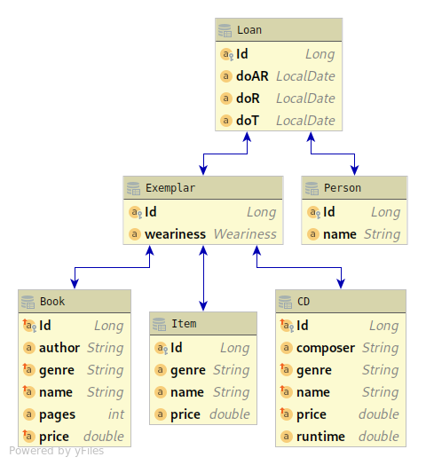
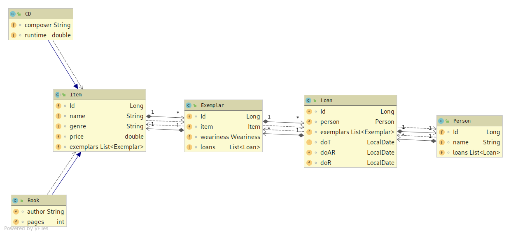

# 01-assignment-quarkus-jpa-Maxwahl

## Goal of this exercise

Goal of this exercise was to demonstrate how to use quarkus in combination with a datasource
and trying to containerize the whole affair.

## Model

The data-model in this exercise resembles a small library.

The library has *Exemplar*s of different *Item*s ( *CD*s or *Book*s in stock).
A *Person* can make *Loan* containing various *Exemplar*s.

### ERD

### CLD

## Running the project

Running the projects requires following steps in order

1. dockerize PostgreSQL database (docker-compose.yml in repo-root)
2. execute buildlibrary.sh
3. execute runlibrary.sh